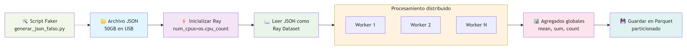
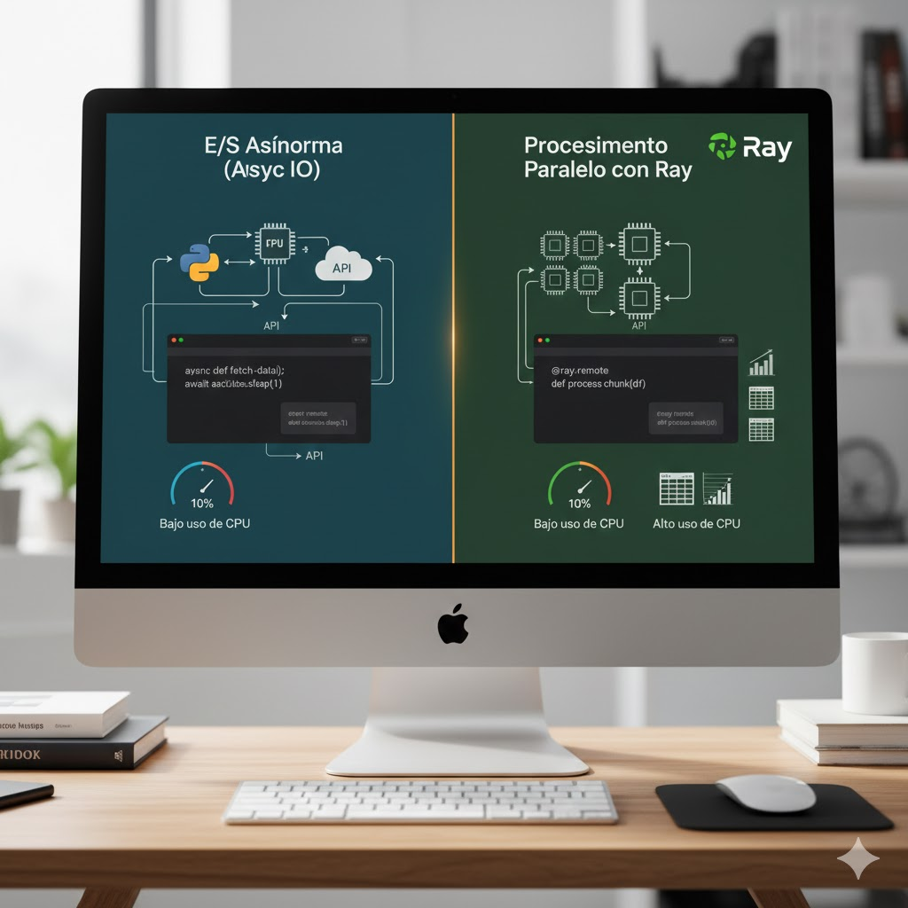

# demo_ray_50gb_json

  


Demo de cómo procesar un archivo JSON Lines muy grande (decenas de GB)
usando **Ray Datasets** en un entorno local (Windows 11).

## 1. Estructura de carpetas del repo
```batch
demo_ray_50gb_json/
├─ README.md
├─ requirements.txt
├─ .gitignore
├─ src/
│  ├─ generar_json_falso.py
│  └─ procesar_con_ray_dataset.py
└─ data/
   ├─ raw/         (JSON en el USB / enlace simbólico, opcional)
   └─ processed/   (salidas parquet, si quieres)
```
__Importante__: data/ normalmente no se sube a GitHub (se ignora con .gitignore).

## 2. requirements.txt

Pon las dependencias mínimas:
```txt
ray[data]
pandas
numpy
faker
```
## 3. Script para generar datos de ejemplo (JSON Lines)

Esto simula el “gran fichero” (1GB, 5GB, 50GB… según configures).
Primero es recomendable empezar con 0.1–1 GB y luego subir.

**Archivo:** `src/generar_json_falso.py`  
Genera un fichero **JSON Lines** (un objeto JSON por línea) con datos ficticios:

- Campos de ejemplo:
  - `id`, `nombre`, `email`, `fecha_registro`, `pais`
  - `x`, `y` (números reales aleatorios)
  - `comentario` (texto libre)
- Tamaño objetivo controlado con `TARGET_SIZE_GB`.
- Escribe línea a línea, sin cargar nunca todo en memoria.

Fragmento de configuración dentro del script:

```python
OUTPUT_PATH = r"E:\datos\archivo50G.json"  # ruta en tu USB o disco
TARGET_SIZE_GB = 1                          # primero pequeño; luego puedes subir a 50
```
## 4. Script principal con Ray Datasets

**Archivo:** `src/procesar_con_ray_dataset.py`  

Hace tres cosas principales:

1. **Leer el JSON “grande” como Ray Dataset**  
   - Usa `ray.data.read_json` sobre un fichero JSON Lines.
   - Ray trata el fichero como muchos bloques (particiones), no como un único DataFrame gigante en RAM.

2. **Transformar los datos por lotes (*batches*) en paralelo**  
   - Define una función `enrich_batch(batch: pd.DataFrame)` que:
     - Añade nuevas columnas, por ejemplo:
       - `z = x² + y²`
       - `xy_mean = (x + y) / 2`
   - `map_batches` aplica esta función a cada batch y Ray reparte el trabajo entre varios núcleos de CPU.

3. **Calcular agregados globales y guardar el resultado**  
   - Calcula medias globales (por ejemplo `mean("z")`, `mean("xy_mean")`).
   - Escribe el resultado en formato **parquet particionado** en una carpeta de salida (una especie de “bucket local”).

## 5. Cómo usarlo en clase (resumen)

   1. Ejecutar el generador de datos sintéticos (JSON Lines):

      ```bash
      python src/generar_json_falso.py
      ```
   2. Verificar el tamaño del fichero JSON (que sea “grandecito”, p. ej. 0.5–1 GB al principio).
   3. Ejecutar el script principal con Ray Datasets:
      ```bash
      python src/procesar_con_ray_dataset.py
      ```
   4. Comentar en clase:
      * Qué hace ray.data.read_json(...):
         * Cómo trata el fichero como muchos bloques (particiones) y no como un único DataFrame gigante.
      * Qué hace map_batches(...):
         * Cómo pasa lotes (batches) de datos a la función de transformación y los reparte entre varios núcleos.
      * Qué implica llamar a mean() o write_parquet(...):
         * Cómo se dispara el cómputo distribuido (cada bloque calcula su parte y Ray combina los resultados).
      * Por qué este patrón se puede escalar:
         * A más núcleos en una máquina,
         * o a varios nodos de un clúster Ray, sin cambiar casi nada del código de transformación.
## 6. Instalación y configuración
Sigue estos pasos para descargar el proyecto y preparar tu entorno de trabajo aislado.

### Clonar el repositorio
```bash
git clone https://github.com/tu_usuario/demo_ray_50gb_json.git
cd demo_ray_50gb_json
```
(Sustituye tu_usuario por tu usuario real de GitHub.)

### Crear y activar el entorno virtual

Es fundamental crear un entorno aislado (env) para no corromper tu instalación local de Python.

#### En Windows:

```bash
python -m venv env
.\env\Scripts\activate
```
#### En Mac / Linux:

```bash
python3 -m venv env
source env/bin/activate
```

__Nota__: Sabrás que funciona si ves (env) al inicio de tu terminal.

### Instalar dependencias
```bash
pip install -r requirements.txt
```

A partir de aquí ya puedes:
* Generar datos con src/generar_json_falso.py.
* Procesarlos con src/procesar_con_ray_dataset.py.
* O abrir el notebook de demo (si lo has creado) en notebooks/01_demo_ray_dataset.ipynb.
